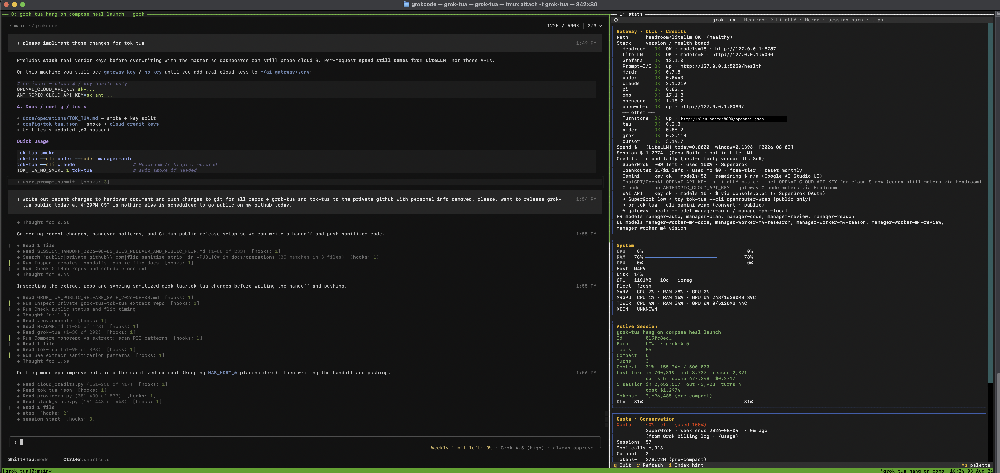
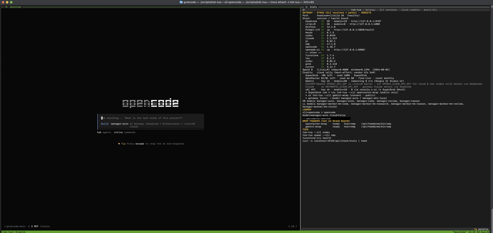

# grok-tua / tok-tua

[](CHANGELOG.md)
[](https://the1truedan.github.io/grok-tua-tok-tua/)

Two small launchers that open a coding CLI next to a live status pane (gateway
health, rough spend, system meters). They talk to a local LLM gateway
(Headroom → LiteLLM) so you can see whether the stack is alive before you
burn a session.

**Site:** [the1truedan.github.io/grok-tua-tok-tua](https://the1truedan.github.io/grok-tua-tok-tua/) ·
**Release:** [`v0.2.0`](CHANGELOG.md)

They live in **one repo on purpose**: each imports a bit of the other. Split
them and both break.

## Multi-agent continuity (start here)

Agents (and humans) should not rediscover progress by filewalking or SSH
hammering. Use the public context-pit contract:

| Doc | Role |
|-----|------|
| **[docs/CONTINUITY.md](docs/CONTINUITY.md)** | Routing law, anti-patterns, plan → handoff |
| **[docs/HANDOFF_TEMPLATE.md](docs/HANDOFF_TEMPLATE.md)** | Paste-first packet after a plan turn |
| **[docs/ORCHESTRATION.md](docs/ORCHESTRATION.md)** | single / herdr / turnstone / loop |
| **[AGENTS.md](AGENTS.md)** | Short start checklist |

```sh
./bin/tok-tua --cli pi --model manager-code   # dual-pane ~80% left / 20% right
./bin/grok-tua
PYTHONPATH=. python3 -m tok_tua loop --cli pi --model manager-code   # dry-run handoff
```

Dual-pane defaults match: **coding left larger**, metrics right (`TOK_TUA_STATS_PCT=20`,
`GROK_TUA_STATS_PCT=20`). Herdr multipane remains optional and still fragile —
prefer `scale=single` first.

## Part of a home-lab stack

These launchers are a **need-born** slice of a larger private mesh (M.A.N.A.G.E.R.):
many coding CLIs needed one safe front door and a visible spend/health pane before
sessions burned out of control.

| Piece | Public role |
|-------|-------------|
| **[ai-gateway](https://github.com/the1truedan/ai-gateway)** | Headroom → LiteLLM glue (the door) |
| **This repo** | How humans/agents open the door (dual-pane CLIs) |
| **[fast-models](https://github.com/the1truedan/fast-models)** | Storage plane for weights/caches (when used) |

**CI smoke** (import + dry-run resolve) runs on GitHub Actions — production-*adjacent*
readiness, not a full home GPU lab. Sensitive care data stays off free-cloud façades;
private document proof lives in a separate private lab, not here.

Story spine: *problem under pressure → tool → smoke receipt → scrubbed public slice*.

## What it looks like

**`grok-tua`** — Grok CLI on the left, stack + quota + fleet dashboard on the right:



**`tok-tua`** — any CLI (here: opencode) on the left, gateway + CLI versions + cloud credits on the right:



<sub>Screenshots are from a real session on the author's lab. Host nicknames and
version numbers are left as-is; one LAN address and one home directory path are
blacked out. Spend and quota figures shown are the author's own.</sub>

## Reading the dashboard

The screenshots compress badly, so here is every field, transcribed.

### Shared by both — Gateway · Stack · Credits

| Row | Example | What it means |
|---|---|---|
| `Path` | `headroom→litellm OK (healthy)` | End-to-end gateway chain reachable |
| `Headroom` | `OK · models=18 · 127.0.0.1:8787` | Context-conservation proxy; model count it advertises |
| `LiteLLM` | `OK · models=8 · 127.0.0.1:4000` | Router / spend ledger |
| `Prompt-I/O` | `up · 127.0.0.1:5050/health` | Prompt capture service |
| `Grafana` / `openweb-ui` / `Turnstone` | `12.1.0` / `:8080` / `:8090` | Dashboards and agent-workflow UI |
| `Herdr` | `0.7.5` | Fleet helper |
| CLI rows | `codex 0.0440` · `claude 2.1.219` · `pi 0.82.1` · `omp 17.1.8` · `opencode 1.18.7` · `grok 0.2.118` · `aider 0.86.2` · `cursor 3.14.7` · `tau 0.2.3` | **Installed version of every coding CLI on the box.** This is the "which agent am I actually running" answer that usually costs a `--version` round trip each. |

**Spend + credits**

| Row | Example | Note |
|---|---|---|
| `Spend $` | `today=0.0000 window=0.1396` | From LiteLLM — the metered source of truth |
| `Session $` | `1.2974 (Grok Build · not in LiteLLM)` | Vendor-side burn the gateway can't see |
| `SuperGrok` | `~0% left · used 100%` | Weekly quota |
| `OpenRouter` | `$1/$1 left · free-tier · reset monthly` | |
| `Gemini` / `xAI` | `key ok · models=50` / `models=10` | Key health; `$` lives in the vendor UI |
| `ChatGPT/OpenAI` | `OPENAI_API_KEY is LiteLLM master` | **Diagnostic, not an error.** Your gateway key is not a vendor key — set `OPENAI_CLOUD_API_KEY` if you want a real cloud-dollar row. Codex still meters through Headroom either way. |

**Model aliases** — `HR models` are Headroom-side routes (`manager-auto`, `-plan`, `-code`,
`-review`, `-reason`); `LL models` are the LiteLLM workers behind them
(`manager-worker-m4-code`, `-research`, `-reason`, `-review`, `-vision`).

### `grok-tua` only

**System / Fleet** — local CPU / RAM / GPU / disk, then every host in the fleet on one line
each (`CPU 7% · RAM 78% · GPU 0% 248/16380MB 39C`), including GPU memory and temperature.
A host that can't be reached reads `UNKNOWN` rather than zero — unavailable is not the same
as idle.

**Active Session**

| Field | Example | Meaning |
|---|---|---|
| `Burn` | `LOW · grok-4.5` | Rough spend rate + model |
| `Tools` / `Turns` / `Compact` | `85` / `3` / `0` | Tool calls, turns, compaction events |
| `Context` | `31% 155,246 / 500,000` | Window used |
| `Last turn` | `in 700,319 out 3,737 reason 2,321 · cache 677,248 $0.2717` | Per-turn token split incl. reasoning and cache-read |
| `Σ session` | `in 2,652,557 out 43,928 · cost $1.2974` | Session totals |

**Quota · Conservation** — `~0% left (used 100%)`, week-end date, and lifetime counters:
`Sessions 57`, `Tool calls 6,013`, `Tokens~ 278.22M (pre-compact)`. Read from the vendor
billing log, not estimated.

### `tok-tua` only

**LAUNCH** — resolved CLI, model, cloud flag, and the binary path actually being executed.

**WRAP FAÇADES** — `openrouter-wrap` and `gemini-wrap`, both `ready host=omp`. Deliberately
listed *outside* the Stack board: they are routing shims, not services with health of their own.

**TIPS** — context-appropriate next commands (`tok-tua --cli codex`, `turnstone-cli health`,
`curl -s localhost:8765/api/stack/stats | head`).

### The point of all this

One screen answers: *is the gateway up, which CLI versions am I on, how much have I spent,
how much quota is left, and is the fleet healthy* — before you start a session rather than
after it fails. That is the whole reason these exist.

## What each one is for

**`grok-tua`** — for the Grok / SuperGrok Build CLI. Left pane: `grok`. Right
pane: a compact dashboard (gateway, quota burn, CPU/RAM/GPU, git). On start it
can poke local Docker (and optionally a remote host) if something looks down.

**`tok-tua`** — same idea for *other* coding CLIs (Claude Code, Codex, Cursor,
aider, OpenCode, and friends — see `tok_tua/providers.py`). Extra knobs:

- **QQQ** (`--qqq 0|1|3`) — prefer local vs paid cloud vs free cloud, with a
  hard “don’t send sensitive care data to the wrong place” rule.
- **Scale** (`--scale single|herdr|turnstone`) — one tmux pair, a multi-agent
  layout, or a web UI hook.
- **Session adapters** — light read of recent CLI session files for the panel.

Shared helpers live under `context/`, plus credit tally helpers for the usual
vendor dashboards (OpenRouter, Gemini, OpenAI, Claude, xAI).

## Layout

```
bin/grok-tua                    launch wrapper (bash) for the Grok/SuperGrok CLI
bin/tok-tua                     launch wrapper (bash) for any registered coding CLI
bin/grok_credit_usage_report.py standalone CLI: usage/credit report, watch loop, session index
grok_tua/                       grok-tua's Python package (dashboard, metrics, voice, credits)
tok_tua/                        tok-tua's Python package (providers, routes, qqq, scale, dashboard)
context/                        shared helpers both packages import (see below)
config/                         JSON config templates (qqq_orchestration.json, tok_tua.json)
.env.example                    copy to .env and fill in for your setup
```

### `context/` package

Trimmed and vendored out of the original monorepo's `integrations/context`
and `memory` packages — only the two leaf modules that grok-tua/tok-tua
actually import, each with zero further external dependencies:

- **`context/grok_credit_monitor.py`** — SuperGrok session discovery, credit
  usage accounting, and the JSON/forensic report formatters used by both the
  dashboards and `bin/grok_credit_usage_report.py`. (Originally
  `integrations/context/grok_credit_monitor.py`.)
- **`context/syn_napse.py`** — a tiny best-effort local audit-log helper,
  used by `tok_tua/qqq.py` to log QQQ-mode selections. Optional: if this
  import fails for any reason, the caller silently skips logging.
  (Originally `memory/syn_napse.py`.)

## What's *not* included

`grok_tua/voice.py` and `tok_tua/voice.py` implement an optional voice mode
(`grok-tua voice …` / `tok-tua voice`) that layers on top of a much larger,
separate personal voice-assistant stack: a "talk2ya" PTT/STT/TTS adapter, a
"V.O.X." orchestrator agent, and further TTS backends (kokoro, chatterbox)
plus an ASR pipeline — none of which are part of this repo. Those imports
are all *lazy* (inside function bodies, not at module import time), so
importing `grok_tua`/`tok_tua` and running the dashboards/routing/QQQ/scale
features works with zero effect from this. Only if you actually invoke
`voice` will you hit a plain `ImportError` for the missing stack — there's
no hidden dependency on it otherwise.

## Install / run

Requires Python 3.10+, `tmux`, and a running OpenAI-compatible gateway
(Headroom → LiteLLM, or point `HEADROOM_BASE`/`LITELLM_BASE` at your own).
`textual` and `psutil` are optional but recommended (`pip install textual
psutil`) for the full dashboard; without them the tools fall back to a
plain `--check` text loop.

```sh
git clone <this-repo>
cd grok-tua-tok-tua
cp .env.example .env      # fill in LITELLM_MASTER_KEY / NAS_HOST_IP etc. as needed
./bin/tok-tua              # launch: codex + metrics dashboard
./bin/tok-tua --cli claude --qqq 0
./bin/grok-tua              # launch: grok + metrics dashboard
```

Every gateway URL defaults to `127.0.0.1` — nothing points at anyone else's
machine out of the box. `.env.example` documents the optional LAN-fallback
variables (`NAS_HOST_IP`, `GPU_HOST_IP`, `NAS_HOST_SSH`, …) if you run your
gateway on a second machine on your own network.

Both wrappers also work invoked directly as Python modules, e.g.:

```sh
PYTHONPATH=. python3 -m tok_tua stack
PYTHONPATH=. python3 -m tok_tua providers
PYTHONPATH=. python3 -m tok_tua spawn --cli pi --dry-run
PYTHONPATH=. python3 -m tok_tua loop --cli pi --model manager-code
PYTHONPATH=. python3 -m tok_tua turnstone health
PYTHONPATH=. python3 -m grok_tua.dashboard --check
```


## How this came to be

Once the local gateway worked, the bottleneck became *starting work*: which
CLI, which model tier, is Headroom up, am I about to burn cloud credit by
mistake? **grok-tua** and **tok-tua** are the launchers that put a coding CLI
beside a live status pane.

They grew out of daily shipping on a caregiving product stack — cloud LLMs
helping sketch QQQ routing and smoke checks, local repo holding the real
scripts. Extracted from the monorepo so the launchers can version on their
own, then published as a small public piece of a larger local-first lab.

**Timeline anchors:** monorepo tooling **July 2026** (v0.2 era); public extract
late **July / early August 2026**.

## License

MIT — see `LICENSE`.

---

<p align="left">
  <a href="https://linktr.ee/the1truedan"></a>
  <a href="https://ko-fi.com/the1truedan"></a>
</p>

**© 2026 M.A.N.A.G.E.R. LLC** — *prepare for the care when we cannot be there*
